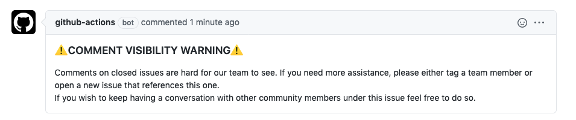

## Closed Issue Message

This action sets a default message to be commented on all issues when they get closed.

## Usage

Add a YAML workflow file into your repository under
`.github/workflows`. 
This workflow file follows the 
[standard workflow syntax for Github Actions](https://help.github.com/en/actions/reference/workflow-syntax-for-github-actions).

For a list of options and their description, see [action.yml](./action.yml).

### Example Workflow
```yml
name: Closed Issue Message
on:
    issues:
       types: [closed]
jobs:
    auto_comment:
        runs-on: ubuntu-latest
        steps:
        - uses: aws-actions/closed-issue-message
            with:
            # These inputs are both required
            repo-token: "${{ secrets.GITHUB_TOKEN }}"
            message: "Comments on closed issues are hard for our team to see." 
```
> You can do a multi line comment by using a pipe: 
```yml
message: |
         ### ⚠️COMMENT VISIBILITY WARNING⚠️ 
         Comments on closed issues are hard for our team to see. 
         If you need more assistance, please either tag a team member or open a new issue that references this one. 
         If you wish to keep having a conversation with other community members under this issue feel free to do so.
                                    
```

## Security

See [CONTRIBUTING](CONTRIBUTING.md#security-issue-notifications) for more information.

## License

This project is licensed under the Apache-2.0 License.
